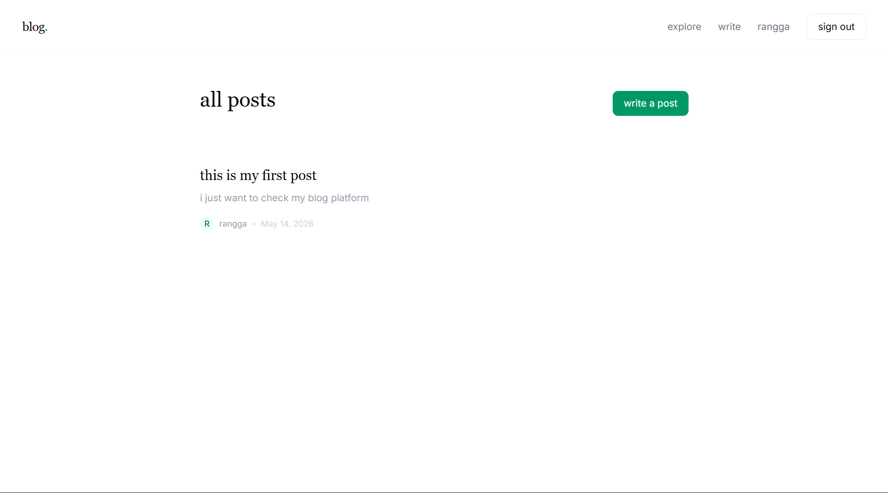
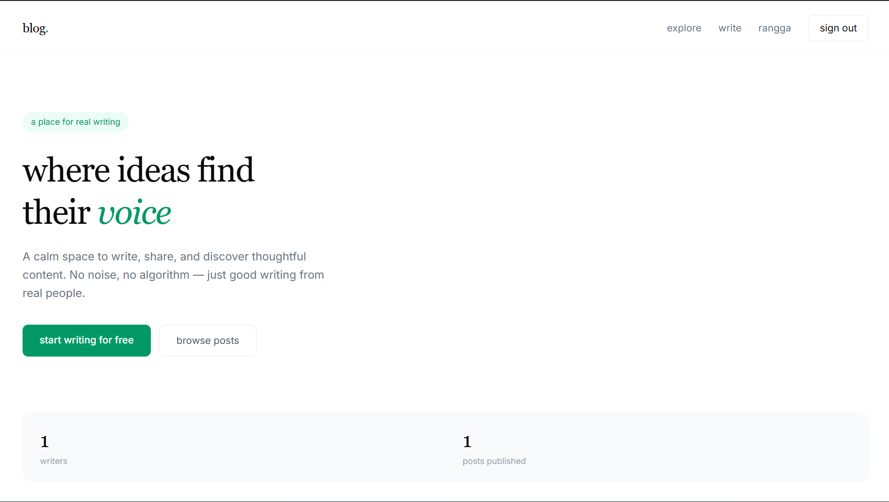

# Writerly

A modern, minimal blog platform where ideas find their voice. Built as a portfolio project to demonstrate full-stack development with the latest Next.js ecosystem.

🔗 **Live Demo**: [writerly-app.vercel.app](https://writerly-app.vercel.app)




---

## Tech Stack

| Category | Technology |
|---|---|
| Framework | Next.js 15 (App Router) |
| Language | TypeScript |
| Styling | Tailwind CSS + shadcn/ui |
| Database | PostgreSQL (Neon) |
| ORM | Drizzle ORM |
| Auth | Better Auth |
| Validation | Zod + React Hook Form |
| Deployment | Vercel |

---

## Features

- **Authentication** — register, login, and logout with email & password
- **Blog Posts** — create, read, update, and delete posts
- **Comments** — leave comments on any post
- **Protected Routes** — only authenticated users can write posts
- **Author-only Actions** — edit and delete only available to post author
- **Responsive UI** — clean, minimal design that works on all devices

---

## Getting Started

### Prerequisites

- Node.js 18+
- PostgreSQL database (Neon recommended)

### Installation

1. Clone the repository

```bash
git clone https://github.com/yourusername/writerly-app.git
cd writerly-app
```

2. Install dependencies

```bash
npm install
```

3. Set up environment variables

```bash
cp .env.example .env
```

Fill in your `.env`:

```env
BETTER_AUTH_SECRET=your_secret_here
BETTER_AUTH_URL=http://localhost:3000
DATABASE_URL=your_neon_connection_string
```

4. Push database schema

```bash
npm run db:push
```

5. Run the development server

```bash
npm run dev
```

Open [http://localhost:3000](http://localhost:3000) to see the app.

---

## Project Structure

```
app/
├── (auth)/         → login & register pages
├── (main)/         → main app with navbar
│   ├── page.tsx    → landing page
│   └── blog/       → blog pages (list, detail, create, edit)
├── api/            → API routes
└── layout.tsx      → root layout

components/
├── shared/         → Navbar, CommentForm, AuthCard
└── ui/             → shadcn components

actions/            → Server Actions (post, comment)
lib/                → auth, db, auth-client
hooks/              → useAuth
```

---

## What I Learned

- Next.js 15 App Router — layouts, Server Components, Server Actions
- Full-stack TypeScript with end-to-end type safety via Drizzle ORM
- Authentication flow with Better Auth and session management
- Form validation with Zod and React Hook Form
- Deploying a full-stack Next.js app to Vercel with Neon PostgreSQL

---

## License

MIT